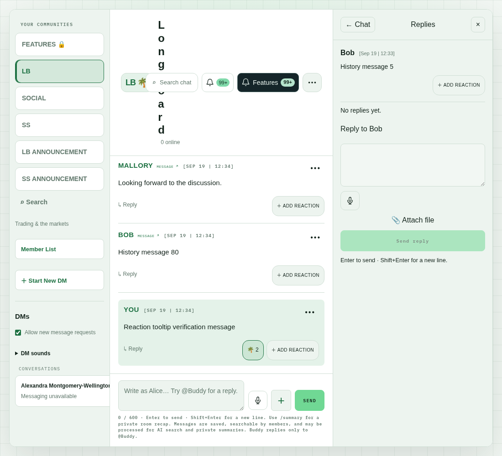
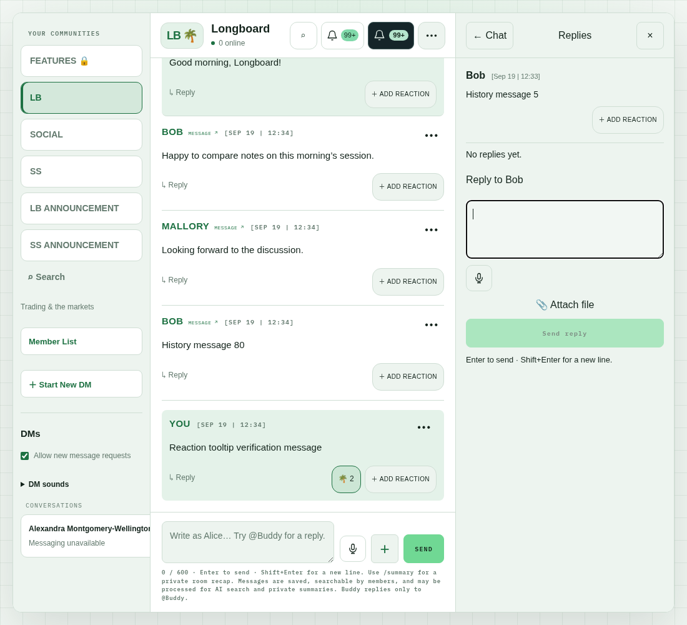
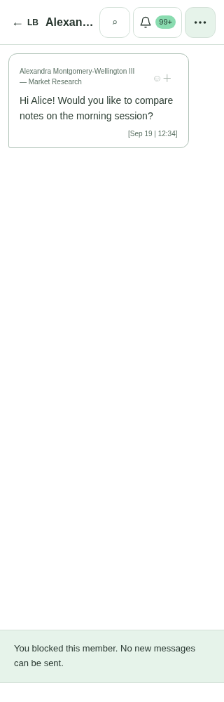
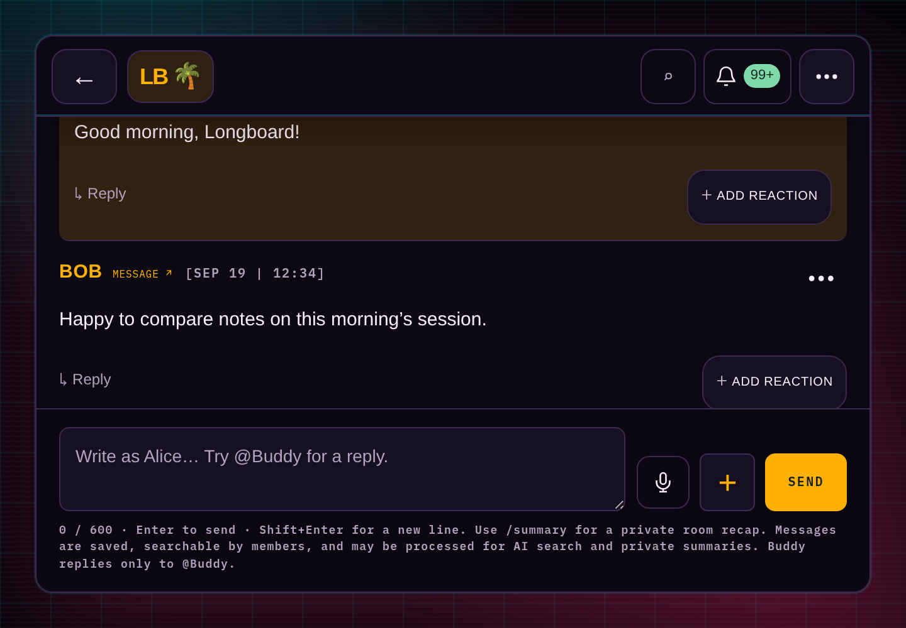

# U01 — consistent chat headers

The room, DM, and thread headers now use the same height: **72 CSS pixels on desktop and 64 on compact layouts**. Desktop room/thread divider mismatch fell to **0 pixels** in every measured case. The 1100px three-column layout no longer wraps “Longboard” letter by letter.

| Viewport width | Before: room/thread divider mismatch | After |
| --- | ---: | ---: |
| 1440px | 33px | 0px |
| 1200px | 80.98px | 0px |
| 1100px | 253.77px | 0px |

Measurements use a long synthetic DM title and 99+ notification badges. All three themes gave identical geometry. This is a layout improvement; no loading-speed improvement is claimed.

## Verification

The actual Next production builds were exercised against the isolated local synthetic chat fixture: S07 baseline on port 3291 and U01 on port 3301. `scripts/tests/chat-u01-header-browser.mjs` is the reproducible browser test; it uses `chat-s07-browser-session.mjs` and the synthetic fixture on port 54478.

The **72-case matrix passed**:

- Widths 1440, 1200, 1100, 1099, 768, 390 and 320px; room, open thread, and long-title DM; light, dark and Blade Runner themes.
- At desktop widths, room/thread divider bottoms align exactly, within the ≤1px requirement. DM headers also measure 72px. Compact room/DM/thread headers measure 64px.
- Navigation, search, the activity bell, and the settings menu remain visible and reachable, checked using actual center-point hit testing. No viewport horizontal overflow.
- Activity popovers remain inside the viewport at 320/390px. The Features popover remains inside the viewport with a thread open at 1100px. Their close controls are clickable.
- Equivalent 200% zoom reflow: 1440×1000 physical pixels represented by a 720×500 CSS viewport at DPR 2, across all three themes and views. This tests layout breakpoints and relative sizing, **not native browser zoom**, OS text scaling, mobile Safari safe areas or physical keyboard behavior.

The test changes only local synthetic response display names/counts to stress header sizing; it does not send messages or change production data. Existing synthetic DM records can be blocked/unavailable; this test evaluates their long-title header rather than message-sending behavior. Physical phone testing remains outstanding.

## Visual evidence

The following screenshots were inspected. The desktop example retains both notification bells and 99+ badges while compacting button labels to fit the available center-column width. The mobile DM title truncates with an ellipsis while leaving navigation/search/bell/menu usable.

Before at 1100px:



After at 1100px:



Long DM title at 320px:



Equivalent 200% zoom, Blade Runner theme:



Raw temporary measurements: `/tmp/chat-u01-baseline/geometry.json` and `/tmp/chat-u01-after/geometry.json`.

Run after starting the local synthetic services:

```sh
CHAT_U01_BASE=http://localhost:3301 CHAT_U01_VARIANT=after CHAT_U01_STRICT=1 node scripts/tests/chat-u01-header-browser.mjs
```
